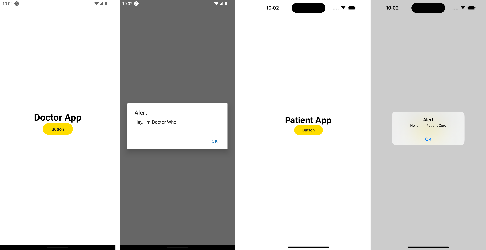

# Monorepo demo app



Built with the official starter Turborepo:

```sh
npx create-turbo@latest
```

## What's inside?

### Apps and Packages

From the starter:

- `eslint-config-custom`: `eslint` configurations (includes `eslint-config-next` and `eslint-config-prettier`)
- `tsconfig`: `tsconfig.json`s used throughout the monorepo

Removed:

- `docs`: a [Next.js](https://nextjs.org/) app
- `web`: another [Next.js](https://nextjs.org/) app

Added:

- `doctor`: a React Native Typescript project
- `patient`: a React Native Typescript project

Modified:

- `ui`: a React Native component library
